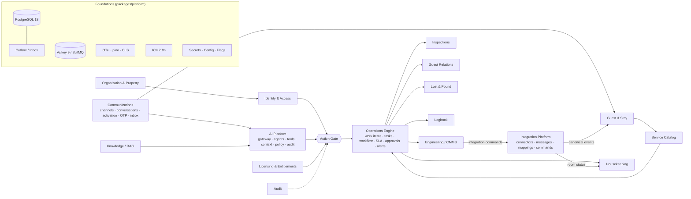
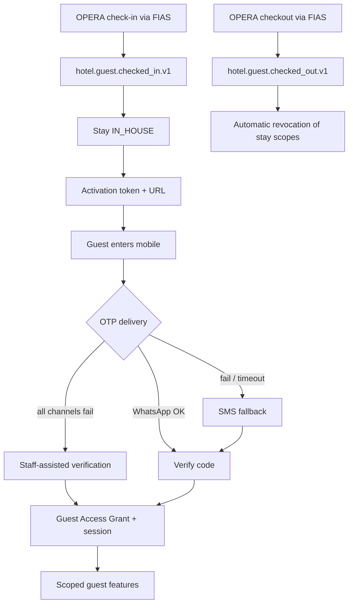
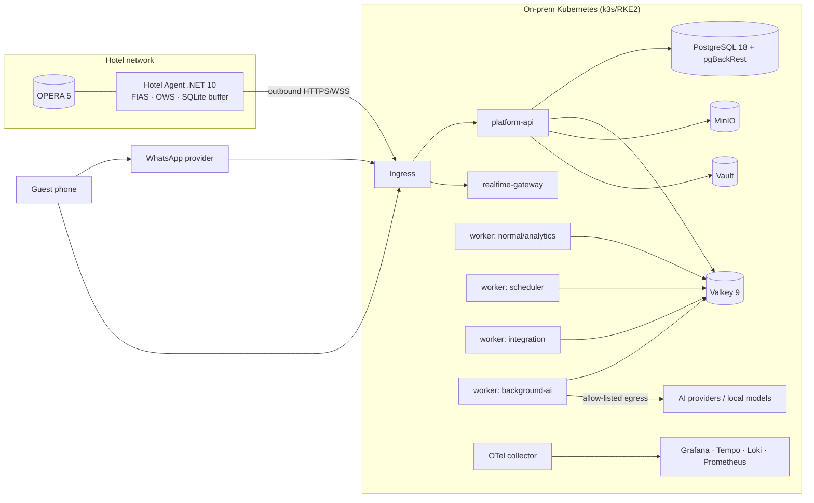

# Architecture Overview (for orientation; the spec is authoritative)

Diagrams are Mermaid and render on GitHub. `dependency-graph.svg` in this folder is generated by CI from dependency-cruiser and shows the real package graph.

## 1. Context map (bounded contexts and how they talk)



Arrows mean "depends on via `/public` interfaces or events". A context never reaches into another context's tables.

## 2. One request end to end (guest asks for towels on WhatsApp)

```mermaid
sequenceDiagram
  autonumber
  participant WA as WhatsApp provider
  participant CH as Channel adapter (comms)
  participant CONV as Conversation engine (comms)
  participant AI as Guest Concierge (ai)
  participant GATE as Action Gate
  participant CAT as Catalog.createServiceRequest
  participant OPS as Operations engine
  participant OUT as Outbox → worker
  participant HK as Housekeeping staff app
  WA->>CH: webhook (signed)
  CH->>CONV: normalized message + channel identity
  CONV->>CONV: resolve guest/stay/room via Guest Access Grant
  CONV->>AI: run agent (context policy: guest, stay, room, services, open requests)
  AI->>GATE: tool operations.create_service_request (LOW risk)
  GATE->>GATE: authz → entitlement → feature → config → AI policy
  GATE->>CAT: execute
  CAT->>CAT: eligibility + duplicate check (relate instead of create)
  CAT->>OPS: create work item + task + SLA (same transaction)
  OPS->>OUT: publish ops.task.assigned.v1, catalog.service_request.created.v1
  OUT-->>HK: realtime update + notification intent
  AI->>CONV: reply in guest's language (Arabic)
  CONV->>CH: send
  CH->>WA: message (delivery events tracked)
  Note over GATE,OUT: every step carries the same correlation_id; audit rows written for the mutation
```

## 3. Guest activation (platform-owned, no OPERA change)



## 4. Deployment (on-prem, ADR-0013)


